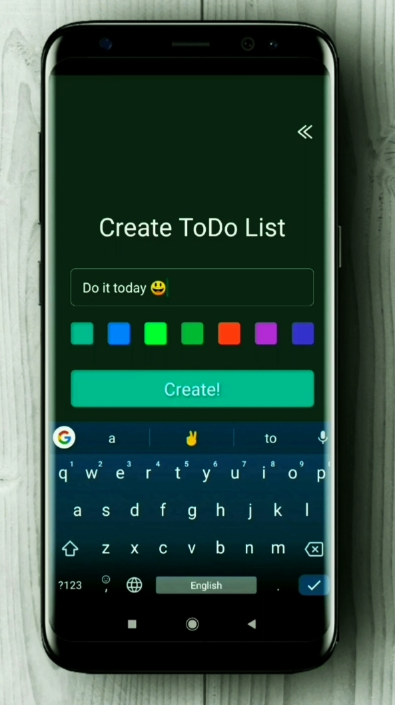
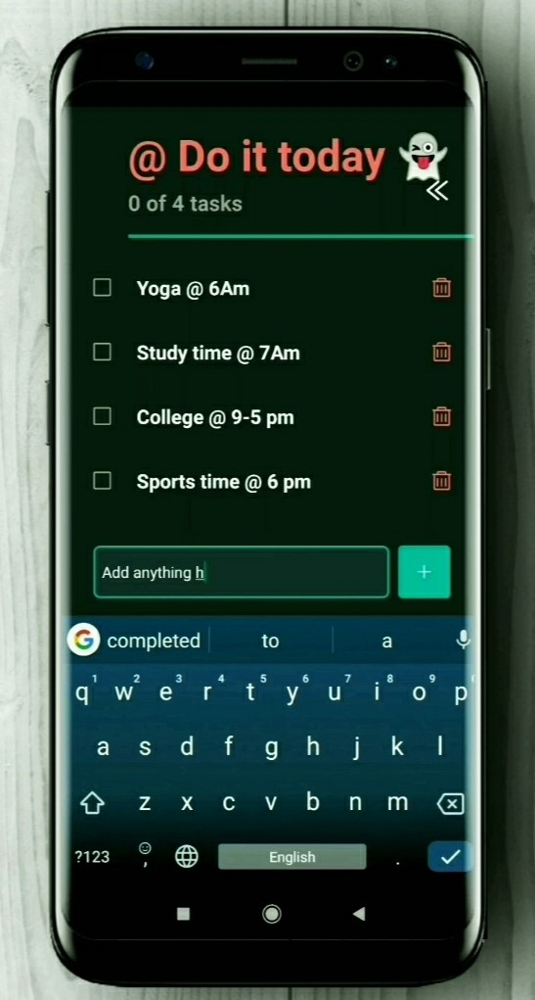

# ToDo-List
A daily todo list app using React-Native


<!--
*** Thanks for checking out this TODO-List using React Native. If you have a suggestion that would
*** make this better, please fork the repo and create a pull request or simply open
*** an issue with the tag "enhancement".
*** Thanks again! Now go create something AMAZING! :D
-->


<!-- PROJECT SHIELDS -->
[![Issues][issues-shield]][issues-url]
[![MIT License][license-shield]][license-url]
[![LinkedIn][linkedin-shield]][linkedin-url]


<!-- PROJECT LOGO -->
<br />
<p align="center">
  <a href="https://github.com/othneildrew/Best-README-Template">
    
  </a>

  <h3 align="center">ToDo-List</h3>

  <p align="center">
A daily todo list app using React-Native
    <br />
    <a href="https://github.com/sudiptarana/ToDo-List#todo-list"><strong>Explore the docs »</strong></a>
    <br />
    <br />
    <a href="https://github.com/sudiptarana/ToDo-List">View Demo</a>
    ·
    <a href="https://github.com/sudiptarana/ToDo-List/issues">Report Bug</a>
    ·
    <a href="https://github.com/sudiptarana/ToDo-List/issues">Request Feature</a>
  </p>
</p>


<!-- ABOUT THE PROJECT -->
## View of This Project

[![Product Name Screen Shot][product-screenshot]](https://diflin.in/)


<p align="center">
  <b>Create Universal React Native apps with no build configuration.</b>
  <br />

  <p align="center">
    <!-- iOS -->
    
    <!-- Android -->
    
    <!-- Web -->
    
  </p>
  <p align="center">
    <a href="https://packagephobia.now.sh/result?p=create-react-native-app">
      
    </a>
  </p>
  
</p>

<!-- Body -->

```sh
npx create-react-native-app
```

Once you're up and running with Create React Native App, visit [this tutorial](https://reactnative.dev/docs/tutorial.html) for more information on building mobile apps with React.

<p align="center">
  
</p>


<p float="left">
  
   
  
</p>

## Features

- Native project ready to be built on to your device.
- Support for unimodules and auto-linking.
- OTA updates, and Gestures out of the box.
- Full support for React Native web.
- Plug-n-play custom templates.
- Works with the Expo Client app.

## Usage

- `npx create-react-native-app` Create a new native React app.
- `yarn ios` -- (`react-native run-ios`) Build the iOS App (requires a MacOS computer).
- `yarn android` -- (`react-native run-android`) Build the Android App.
- `yarn web` -- (`expo start:web`) Run the website in your browser.

### Templates

By default you create a [bare-workflow React](https://docs.expo.io/bare/exploring-bare-workflow/) project with support for iOS, Android, and web. You can opt to use an example project instead by selecting the "Templates from ..." option. Custom templates can be used with `--template <Example Name or GitHub URL>` option.

- Use an [example](https://github.com/expo/examples): `npx create-react-native-app -t with-typescript`
- Use a custom template: `npx create-react-native-app --template https://github.com/someone/my-react-starter` -- Only works with GitHub repos on the master branch.
- All examples can be modified in the [expo/examples](https://github.com/expo/examples) repo.

## Sections

- [Usage with Expo Client App](#usage-with-expo-client-app)
- [Support and Contact](#support-and-contact)
- [FAQs](#faqs)
- [Contributing](#contributing)

## Usage with Expo Client App

Expo Client enables you to work with all of the [Components and APIs](https://facebook.github.io/react-native/docs/getting-started.html) in `react-native`, as well as the [JavaScript APIs](https://docs.expo.io/versions/latest/sdk/index.html) that the are bundled with the Expo App.

Expo Client supports running any project that doesn't have custom native modules added.

- Download the "Expo Client" app from the Play Store or App Store.
- Start your project with Expo
  - Install the CLI `npm i -g expo-cli`
  - Start the project `expo start`
- Open the project:
  - Sign in to expo and the project will appear in the app.
  - Or point your phone's camera at the QR code in the terminal (press "c" to view it).

## Support and Contact

If you're having issues with Create React Native App, please make sure:

- The issue is not covered in the [Expo Docs](https://docs.expo.io/versions/latest/)
- There is not already an [open issue](https://github.com/expo/expo-cli/issues) for your particular problem

If you've checked the documentation and currently open issues, please either [open a new GitHub issue](https://github.com/expo/create-react-native-app/issues/new) or ask a question on [Expo forums](https://forums.expo.io/c/help).

## Contributing

Please see [Contributing guide](https://github.com/expo/expo-cli/blob/master/CONTRIBUTING.md) in the Expo CLI monorepo for instructions on contributing to Expo CLI.

### Attribution

The examples feature was inspired by the `templates` system of [create-next-app](https://github.com/zeit/next.js/tree/canary/packages/create-next-app) by the [Vercel](https://vercel.com/) team.

## Related

- [Ignite CLI](https://github.com/infinitered/ignite) by [Infinite Red](https://infinite.red/)
- [Expo CLI](https://github.com/expo/expo-cli) by [Expo team](https://expo.io)
- [React Native Community CLI](https://github.com/react-native-community/cli) by members of [the React Native community](https://github.com/orgs/react-native-community/people)

<!-- Footer -->

There are many great README templates available on GitHub, however, I didn't find one that really suit my needs so I created this enhanced one. I want to create a README template so amazing that it'll be the last one you ever need.

Here's why:
* Your time should be focused on creating something amazing. A project that solves a problem and helps others
* You shouldn't be doing the same tasks over and over like creating a README from scratch
* You should element DRY principles to the rest of your life :smile:

Of course, no one template will serve all projects since your needs may be different. So I'll be adding more in the near future. You may also suggest changes by forking this repo and creating a pull request or opening an issue.

A list of commonly used resources that I find helpful are listed in the acknowledgements.

### Built With
This section should list any major frameworks that you built your project using. Leave any add-ons/plugins for the acknowledgements section. Here are a few examples.
* [Bootstrap](https://getbootstrap.com)
* [JQuery](https://jquery.com)
* [Laravel](https://laravel.com)


<!-- GETTING STARTED -->
## Getting Started

This is an example of how you may give instructions on setting up your project locally.
To get a local copy up and running follow these simple example steps.

### Prerequisites

This is an example of how to list things you need to use the software and how to install them.
* npm
```sh
npm install npm@latest -g
```

### Installation

1. Get a free API Key at [https://example.com](https://example.com)
2. Clone the repo
```sh
git clone https://github.com/your_username_/Project-Name.git
```
3. Install NPM packages
```sh
npm install
```
4. Enter your API in `config.js`
```JS
const API_KEY = 'ENTER YOUR API';
```


<!-- USAGE EXAMPLES -->
## Usage

Use this space to show useful examples of how a project can be used. Additional screenshots, code examples and demos work well in this space. You may also link to more resources.

_For more examples, please refer to the [Documentation](https://example.com)_


<!-- ROADMAP -->
## Roadmap

See the [open issues](https://github.com/othneildrew/Best-README-Template/issues) for a list of proposed features (and known issues).


<!-- LICENSE -->
## License

Distributed under the MIT License. See `LICENSE` for more information.


<!-- CONTACT -->
## Contact

Sudipta Rana - [@linkedin](https://www.linkedin.com/in/sudipta-rana/) - info.diflin@gmail.com

Project Link: [https://github.com/sudiptarana/ToDo-List](https://github.com/sudiptarana/ToDo-List)


<!-- MARKDOWN LINKS & IMAGES -->
[issues-shield]: https://img.shields.io/github/issues/othneildrew/Best-README-Template.svg?style=flat-square
[issues-url]: https://github.com/sudiptarana/ToDo-List/issues
[license-shield]: https://img.shields.io/github/license/othneildrew/Best-README-Template.svg?style=flat-square
[license-url]: https://github.com/sudiptarana/ToDo-List/blob/main/LICENSE
[linkedin-shield]: https://img.shields.io/badge/-LinkedIn-black.svg?style=flat-square&logo=linkedin&colorB=555
[linkedin-url]: https://www.linkedin.com/in/sudipta-rana/
[product-screenshot]: images/screenshot.jpg
[product-screenshot2]: images/screenshot2.jpg
[product-screenshot3]: images/screenshot3.jpg
[product-screenshot4]: images/screenshot4.jpg
